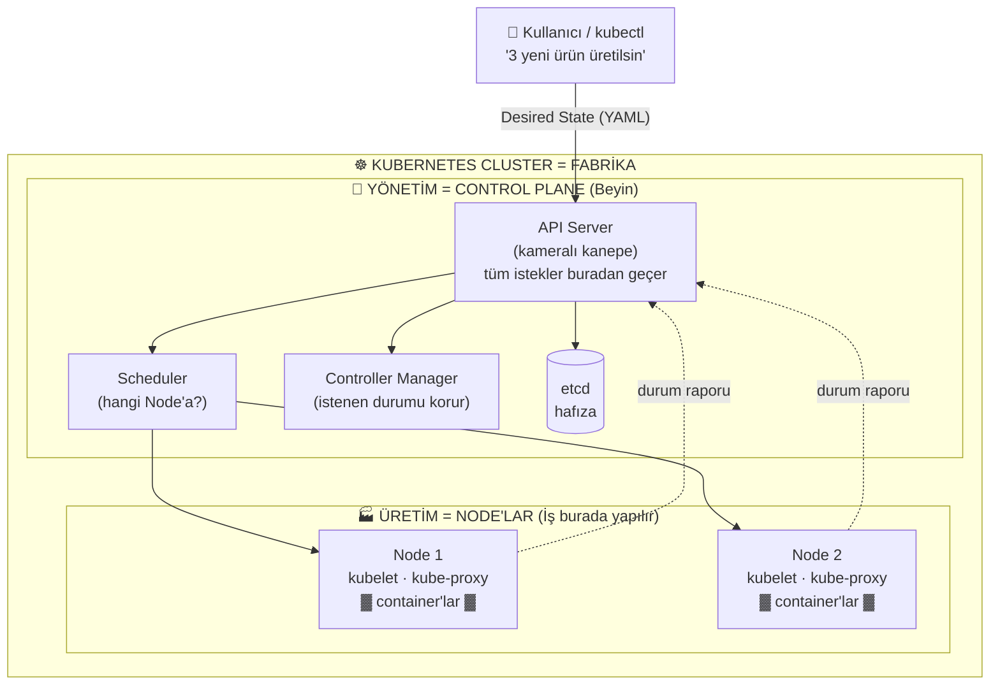

# 02 - Kubernetes Mimarisi (Teori)

## 📝 Özet
Mikroservis mimarisini, Kubernetes'in declarative çalışma mantığını (desired vs current state) ve Control Plane / Node bileşenlerini bir fabrika benzetmesiyle öğrendim.

## 🔑 Anahtar Kavramlar
- **Control Plane:** kube-apiserver, etcd, scheduler, controller-manager
- **Worker Node:** kubelet, kube-proxy, container runtime (containerd)
- Desired State (istenen durum) mantığı
- Cluster / Node / Pod hiyerarşisi

## 💡 Notlarım

### Monolithic vs Microservice

- **Monolithic :** Uygulamanın tüm parçaları (frontend, backend, veritabanı erişimi, iş mantığı...) tek bir büyük blok halinde, birbirine bağlı olarak geliştirilir ve tek parça olarak dağıtılır.
  - Küçük bir değişiklik için bile tüm uygulamayı yeniden derleyip dağıtman gerekir.
  - Sadece bir kısmı yük altındaysa bile, ölçeklerken tüm uygulamayı kopyalaman gerekir.
- **Microservice :** Uygulama, her biri bağımsız çalışan küçük servislere bölünür. Her servis ayrı geliştirilir, dağıtılır ve ölçeklenir.
  - Sadece yük alan servisi ölçekleyebilirsin.
  - Bir servis çökse bile diğerleri ayakta kalabilir.
  - Container ve Kubernetes, bu mikroservis mimarisini yönetmek için biçilmiş kaftandır.

### Imperative vs Declarative Yöntem

- **Imperative (emir kipi):** Adım adım "nasıl" yapılacağını söylersin. Marangoza "şu tahtayı kes, buraya çivi çak, sonra zımparala..." demek gibi.
- **Declarative (bildirim kipi):** Sadece "ne" istediğini, yani **son durumu** tarif edersin; nasıl yapılacağını sistem halleder. Marangoza *"185x110x45 boyutlarında, çift kapılı, masif ahşap, vernikli bir elbise dolabı istiyorum"* demek gibi.

Kubernetes **declarative** çalışır: Sen istediğin son durumu bir YAML dosyasında tarif edersin, Kubernetes o duruma ulaşmak için gerekeni kendi yapar.

### Desired State vs Current State

Kubernetes'in kalbindeki mantık budur:

- **Desired State (İstenen / Deklare Edilen Durum):** 
  - Sistemde toplam 10 container çalışacak
  - Dış dünyaya 80 portundan yayınlanacak
  - Güncelleme yaparken aynı anda 2 container güncellenecek, aralarda 10 saniye beklenecek
- **Current State (Mevcut Durum):** O an cluster'da gerçekte ne olduğu (ör. şu anda 10 container çalışıyor).

Kubernetes sürekli bu ikisini karşılaştırır ve **mevcut durumu, istenen duruma eşitlemeye** çalışır. Örneğin container'lardan biri çökerse (mevcut = 9), Kubernetes fark eder ve istenen sayıya (10) ulaşmak için yenisini otomatik başlatır. Bu sürekli döngüye **reconciliation (uzlaştırma)** denir.

### Kubernetes Modüler Yapısı

Bir Kubernetes **cluster**'ı iki ana bölümden oluşur: **Control Plane** (beyin) ve **Node**'lar (kaslar).

**Control Plane (Yönetim Katmanı)** — cluster'ın kararlarını verir:
- **API Server (api)** — cluster'ın giriş kapısı. Tüm iletişim (kubectl, diğer bileşenler) buradan geçer.
- **etcd** — cluster'ın hafızası. Tüm durum bilgisi burada key-value olarak saklanır (persistence store).
- **Scheduler (sched)** — yeni bir pod'un hangi node'da çalışacağına karar verir.
- **Controller Manager (c-m)** — controller'ları çalıştırır, istenen durumu korur.
- **Cloud Controller Manager (c-c-m)** — bulut sağlayıcıyla entegrasyon (opsiyonel; sadece bulutta çalışırken).

**Node (İşçi Sunucular)** — uygulamaların gerçekten çalıştığı yer:
- **kubelet** — node üstündeki ajan. API Server'dan emir alır, container'ları çalıştırır ve durumlarını raporlar.
- **kube-proxy (k-proxy)** — node'un ağ kurallarını yönetir, servis trafiğini yönlendirir.

> Özet akış: Ben `kubectl` ile **API Server**'a bir istek yollarım → API Server bunu **etcd**'ye yazar → **Scheduler** uygun node'u seçer → o node'daki **kubelet** container'ı ayağa kaldırır.

### Kubernetes Bileşenleri — Fabrika Benzetmesi

Kubernetes bileşenlerini bir **fabrika** gibi düşünebiliriz. Fabrika ikiye ayrılır: **yönetim** ve **üretim**.

| Fabrikadaki karşılığı | Kubernetes'teki karşılığı | Görevi |
|---|---|---|
| Fabrikanın tamamı | **Cluster** | Tüm sistem |
| Yönetim bölümü | **Control Plane** | Kararların alındığı beyin |
| Üretim bölümü | **Node'lar** | İşin gerçekten yapıldığı yer |
| Dışarıdan gelen sipariş (bina) | **Kullanıcı / kubectl isteği** | Ne istediğimizi söyleriz |
| Sipariş dökümanı | **YAML / Desired State** | İstenen son durumun tarifi |
| Kameralı kanepe (her şeyi izleyen giriş) | **API Server** | Tüm istekler buradan geçer, her şeyi gözler |
| Toplantı masası + plan çizen ekip | **Scheduler + Controller Manager** | Hangi makinede, nasıl üretileceğine karar verir |
| Üretimdeki robot kollar | **Node üstündeki makineler** | Kapasite / kaynak |
| Baretli işçiler | **kubelet** | Her makinede işi fiilen yürüten ajan |

**Senaryodaki talep şöyleydi:** *"X-Y-Z ebat ve özelliklerinde 3 yeni ürün üretilsin. Üretim yapılacak makineler 3, 9, 17. İşçi sayısı 3."*

Bu tam da **declarative** bir istektir — "nasıl" yapılacağını değil, "ne" istediğimizi söyleriz. Talep önce **API Server**'a ulaşır, ardından **yönetim ekibi** (scheduler/controller) planı yapıp üretim bölümündeki (**node**) işçilere (**kubelet**) dağıtır. Böylece istenen durum üretime dönüşür.

### Fabrika Benzetmesi (Diyagram)

Bu diyagram şunu anlatıyor: sen isteği (Desired State) `kubectl` ile API Server'a yollarsın → API Server bunu etcd'ye kaydeder, Scheduler'a ve Controller Manager'a iletir → Scheduler işi uygun Node'lara dağıtır → Node'lardaki kubelet container'ları çalıştırır ve durumu (kesikli oklar) API Server'a geri raporlar.
